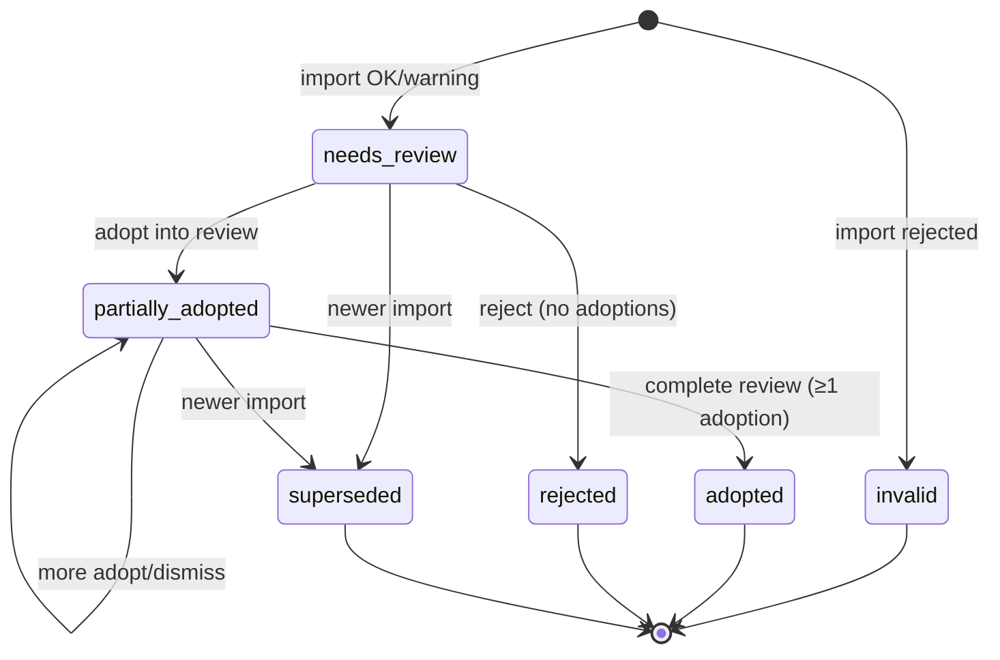

# AI Evaluation Staging Spec（Sprint 5B）

Status: **仕様固定（設計のみ）**  
Scope: 文書のみ。DB migration / アプリコード / Server Action / UI は変更しない。  
前提: `01_ai_evaluation_package_spec.md` / `02_ai_evaluation_policy.md` / result schema

---

## 1. 目的

AI 評価結果 JSON を安全に取り込み、**既存 `assessment_reviews` へ直接反映せず**、教員が確認のうえ採用・一部採用・修正・却下できる staging 構造を固定する。

原則:

- AI 結果は教員の確定評価ではない
- 自動採用禁止
- `private_note` / `teacher_observation` / `overall_comment` の自動投入禁止（本仕様のマッピング）
- 学生は request / staging / adoption / audit に一切アクセス不可
- `raw_result_json` は学生へ絶対公開しない

関連詳細:

- 取込検証: `04_ai_evaluation_import_validation.md`
- 採用フロー: `05_ai_evaluation_adoption_flow.md`

---

## 2. 設計判断（確定）

| # | 判断 |
|---|------|
| 1 | `evaluation_request_id` ↔ 実 submission は **package 生成時**に正本記録。取込時の手選択禁止 |
| 2 | 正本テーブル: `assessment_ai_evaluation_requests` |
| 3 | staging 状態: `invalid` / `needs_review` / `partially_adopted` / `adopted` / `rejected` / `superseded`。`imported` は永続しない |
| 4 | version: request/schema 不一致は invalid。rubric 等は warning＋**警告単位 ack** 後のみ採用可 |
| 5 | 一部採用は `partially_adopted`。追加採用可。履歴は上書きしない。`partially_adopted`→`rejected` **禁止** |
| 6 | 採用履歴: `assessment_ai_evaluation_adoptions` |
| 7 | 採用は review `draft` かつ非返却中のみ。optimistic locking 必須 |
| 8–10 | observation / overall / PII の扱いは採用判断どおり（詳細は 04・05） |
| 11 | 初期取込は手動 JSON アップロード。API callback は初期スコープ外 |
| 12 | adopt / reject / 確認完了は teacher のみ。admin 代行 adopt は初期 OFF |
| 13–14 | マッピング・監査は採用判断どおり |
| 15 | request TTL **90日**。期限後 `expired`。物理削除しない |
| 16 | `result_hash` = normalized の canonical JSON の SHA-256 |
| 17 | 同一 submission のアクティブ staging（`needs_review`\|`partially_adopted`）は原則1件 |
| 18 | adopted 判定はカバー率ではなく、教員の「AI候補の確認を完了」 |

---

## 3. テーブル最終案

### 3.1 `assessment_ai_evaluation_requests`（package 生成正本）

package 生成時に **必ず** 1 行作成する。取込はこの表で `evaluation_request_id` → `assessment_submission_id` を解決する。教員の手選択は禁止。

| カラム | 型（案） | 必須 | 説明 |
|--------|----------|------|------|
| `id` | uuid PK | ○ | |
| `evaluation_request_id` | uuid | ○ | **UNIQUE**。package / result の同一 ID |
| `organization_id` | uuid FK | ○ | |
| `assessment_submission_id` | uuid FK | ○ | 実提出 ID |
| `assessment_cycle_id` | uuid | ○ | クエリ用（生成時に確定） |
| `assessment_milestone_id` | uuid | ○ | |
| `student_user_id` | uuid | ○ | 内部のみ。学生露出なし |
| `package_schema_version` | integer | ○ | |
| `result_schema_version` | integer | ○ | 期待する結果 schema（生成時点） |
| `compass_policy_version` | text | ○ | |
| `rubric_version` | text | ○ | |
| `gold_standard_version` | text | ○ | 例: `patient-a/1` |
| `case_version` | text | ○ | |
| `export_schema_version` | integer | ○ | |
| `package_hash` | text | ○ | 生成 package の正規化ハッシュ |
| `anonymous_submission_id` | text | ○ | 5A 匿名 `sub_*`（照合補助） |
| `generated_at` | timestamptz | ○ | TTL 起算点 |
| `generated_by` | uuid | ○ | teacher/admin |
| `status` | text | ○ | **`generated` / `used` / `expired` のみ** |
| `used_at` | timestamptz | null可 | 初回の有効取込成功時刻（`needs_review` 確定時） |
| `expires_at` | timestamptz | ○ | `generated_at + 90 days`（生成時に固定） |
| `created_at` / `updated_at` | timestamptz | ○ | |

#### request `status`（確定）

| 値 | 意味 |
|----|------|
| `generated` | package 生成済・まだ有効取込なし（期限内） |
| `used` | 少なくとも1件、`needs_review` として staging 取込成功（`used_at` 設定）。TTL 経過後も監査用に `used` のまま残してよい |
| `expired` | `generated_at` から90日経過し、**新規取込不可**。レコードは物理削除しない |

#### TTL ルール（確定）

- 有効期間: **生成から90日**（`expires_at = generated_at + interval '90 days'`）
- 期限後: status を `expired` に更新（バッチまたは取込時の遅延判定）。**新規取込不可**
- **物理削除しない**（監査・説明責任）
- 期限内に取り込まれた staging の教員確認（ack / adopt / dismiss / 確認完了）は、request が後から `expired` になっても **継続可能**
- `generated` のまま期限切れ → `expired`（取込不可）
- `used` のまま期限切れ → 新規取込は不可。既存 staging の確認は継続可。status 表示は実装で `used` 維持＋`expires_at` 参照、または注記付き `expired` への遷移を選ぶ。**仕様推奨:** `used` は維持し、`expires_at < now()` なら「追加取込不可・確認継続可」と判定する

### 3.2 `assessment_ai_evaluation_staging`（AI 結果候補）

| カラム | 型（案） | 必須 | 説明 |
|--------|----------|------|------|
| `id` | uuid PK | ○ | |
| `organization_id` | uuid FK | ○ | |
| `request_id` | uuid FK | ○ | → requests |
| `evaluation_request_id` | uuid | ○ | |
| `assessment_submission_id` | uuid FK | ○ | request と一致必須 |
| `assessment_cycle_id` / `milestone_id` / `student_user_id` | uuid | ○ | |
| version 群 | 各型 | ○ | result metadata から転記 |
| `raw_result_json` | jsonb | ○ | 受領原文。**学生非公開** |
| `normalized_result_json` | jsonb | null可 | 検証・hash 用正規化結果 |
| `validation_status` | text | ○ | `ok` / `warning` / `invalid` |
| `validation_errors` | jsonb | ○ | |
| `version_warnings` | jsonb | ○ | 警告オブジェクト配列（code + payload） |
| `pii_warnings` | jsonb | ○ | 同上（version と分離） |
| `review_status` | text | ○ | §5 |
| `result_hash` | text | ○ | §4 / 04 固定アルゴリズム |
| `source_model` / `source_provider` / `prompt_version` | text | null可 | |
| `imported_at` / `imported_by` | | ○ | |
| `rejected_at` / `rejected_by` / `rejection_reason` | | null可 | `needs_review`→`rejected` のみ |
| `completed_at` / `completed_by` | | null可 | 「AI候補の確認を完了」実行時 |
| `superseded_by` | uuid | null可 | |
| `teacher_draft_overlay_json` | jsonb | null可 | Action 経由のみ更新 |
| `created_at` / `updated_at` | | ○ | |

一括 boolean の `warnings_acknowledged_*` は **持たない**。ack は子テーブル（§3.5）。

### 3.3 `assessment_ai_evaluation_adoptions`（採用履歴・追記のみ）

| カラム | 型（案） | 必須 | 説明 |
|--------|----------|------|------|
| `id` | uuid PK | ○ | |
| `organization_id` | uuid FK | ○ | |
| `staging_id` | uuid FK | ○ | |
| `assessment_review_id` | uuid FK | ○ | |
| `adoption_sequence` | integer | ○ | staging 内 1 始まり |
| `adoption_selection_json` | jsonb | ○ | 採用キー／コメントブロック／**dismissed** 項目 |
| `review_before_snapshot_json` | jsonb | ○ | |
| `applied_snapshot_json` | jsonb | ○ | 今回 review に書いた内容（dismiss のみの行は空オブジェクト可） |
| `review_updated_at_before` / `after` | timestamptz | ○※ | review を更新する場合必須。dismiss のみで review 非更新なら before=after=現在の updated_at |
| `adopted_at` / `adopted_by` | | ○ | teacher |
| `created_at` | timestamptz | ○ | |

**UPDATE/DELETE しない。** 採用されなかった項目は `dismissed` として selection 履歴に残す（詳細は 05）。

### 3.4 監査テーブル

`assessment_ai_evaluation_audit_logs`（5A と同型思想）: service_role INSERT のみ。本文全文を重複保存しない。

### 3.5 `assessment_ai_evaluation_warning_acks`（警告単位 ack）

| カラム | 必須 | 説明 |
|--------|------|------|
| `id` | ○ | |
| `organization_id` | ○ | |
| `staging_id` | ○ | |
| `warning_family` | ○ | `version` \| `pii`（別々に確認） |
| `warning_code` | ○ | 例: `rubric_version_mismatch` |
| `warning_payload_hash` | ○ | 当該警告 payload の canonical SHA-256 |
| `acknowledged_by` | ○ | teacher |
| `acknowledged_at` | ○ | |
| `created_at` | ○ | |

- 一括 boolean は使わない
- 再検証で payload が変わった警告は **旧 ack 無効**（payload_hash 不一致）
- 未確認警告が1件でもあれば adopt 不可（04）

---

## 4. 制約・index 案

### requests

- `UNIQUE (evaluation_request_id)`
- `CHECK (status IN ('generated', 'used', 'expired'))`
- `INDEX (organization_id, assessment_submission_id, generated_at desc)`
- `INDEX (expires_at)`（期限切れ処理用）

### staging

- `UNIQUE (evaluation_request_id)`
- `UNIQUE (organization_id, result_hash)` — 同一 org + 同一評価内容の重複取込拒否
- `INDEX (organization_id, assessment_submission_id, imported_at desc)`
- `CHECK (review_status IN ('invalid','needs_review','partially_adopted','adopted','rejected','superseded'))`

**アクティブ staging partial unique index（案）:**

```sql
CREATE UNIQUE INDEX assessment_ai_eval_staging_one_active_per_submission
  ON public.assessment_ai_evaluation_staging (assessment_submission_id)
  WHERE review_status IN ('needs_review', 'partially_adopted');
```

- 同一 `assessment_submission_id` に対し、`needs_review` または `partially_adopted` は原則1件
- 新結果取込前に旧アクティブ行を `superseded` へ移してから INSERT
- `adopted` / `rejected` / `invalid` / `superseded` は履歴として残す（この index の対象外）

### adoptions / warning_acks / audit

- adoptions: `UNIQUE (staging_id, adoption_sequence)`
- warning_acks: `UNIQUE (staging_id, warning_family, warning_code, warning_payload_hash)`（同一内容の二重 ack 防止）または最新のみ有効とするアプリ規約
- audit: org + created_at / action / actor indexes

---

## 5. 状態遷移（確定）

### 5.1 許可される遷移

```
[取込終了]
   ├─ 拒否検証 → invalid（終端）
   └─ それ以外 → needs_review

needs_review
   ├─ adopt（1回目以降の反映）     → partially_adopted
   ├─ reject（採用履歴0のまま却下） → rejected（終端）
   └─ 新有効取込                    → superseded（終端）

partially_adopted
   ├─ 追加 adopt / dismiss 記録     → partially_adopted（確認中）
   ├─ 「AI候補の確認を完了」
   │     └─ review 反映の採用履歴 ≥ 1 → adopted（終端）
   └─ 新有効取込                    → superseded（終端）

注:
  - dismiss のみ（review 非更新）では partially_adopted に入らない（needs_review のまま）。詳細は 05。
  - 採用履歴0で候補を閉じるのは needs_review → rejected（reject Action）のみ。

禁止:
  partially_adopted → rejected
  needs_review → adopted（直接遷移禁止。adopt 後に確認完了 Action）
  カバー率による自動 adopted
```

**`imported` は永続しない。**

### 5.2 図



### 5.3 adopted / rejected 判定（staging。review 状態とは分離）

| 操作 | 結果 |
|------|------|
| 「AI候補の確認を完了」（`partially_adopted` かつ review 反映採用 ≥ 1） | `adopted` |
| `needs_review` から reject（採用履歴 0） | `rejected` |
| rubric 採用率・カバー率 | **使用しない** |
| `assessment_reviews` の completed/returned | staging 状態を変えない |

未採用項目は `dismissed` として selection 履歴に残す（05）。一度でも review へ反映した候補全体を「却下」と表現しない → ゆえに `partially_adopted`→`rejected` 禁止。

---

## 6. 権限と RLS（確定）

| 操作 | teacher | admin | student |
|------|---------|-------|---------|
| request / staging / adoption **SELECT**（自組織） | ○ | ○ | × |
| import（JSON） | ○ | ○ | × |
| warning ack | ○ | × | × |
| overlay 編集 | ○ | × | × |
| adopt / dismiss / 確認完了 | ○ | **×（初期 OFF）** | × |
| reject（`needs_review` のみ） | ○ | × | × |
| supersede（取込処理内） | （システム） | （システム） | × |
| クライアント直接 UPDATE/INSERT | **禁止** | **禁止** | × |
| audit 直接 SELECT | × | × | × |

**RLS:**

| テーブル | SELECT | 書込 |
|----------|--------|------|
| requests / staging / adoptions / warning_acks | teacher+admin・自組織 | **ポリシー上の直接 INSERT/UPDATE は付与しない**（または失敗するダミー）。実書込は Server Action / SECURITY DEFINER RPC + service_role |
| audit | なし | service_role INSERT のみ |

学生の SELECT ポリシーは作らない。

---

## 7. 監査（概要）

- `import` / `validation` / `warning_ack` / `partial_adopt` / `dismiss` / `complete_candidate` / `reject` / `supersede`
- hash・selection・version・actor・timestamp を記録。本文全文は監査に重複保存しない

---

## 8. UI 状態（概要）

| staging | 操作 |
|---------|------|
| `needs_review` | version/PII を**別々に**警告単位 ack → 採用 / 却下 |
| `partially_adopted` | 追加採用・項目 dismiss・**確認完了**（→adopted）。却下ボタンなし |
| `adopted` / `rejected` / `invalid` / `superseded` | 参照のみ |

詳細は 05。

---

## 9. エラーケース（一覧）

| ケース | 結果 |
|--------|------|
| request `expired` / TTL 超過の新規取込 | 拒否 |
| 重複 `evaluation_request_id` / `(org, result_hash)` | 拒否 |
| アクティブ staging が既にあり置換失敗 | 取込失敗 |
| 未 ack 警告ありで adopt | 拒否 |
| `partially_adopted` で reject | 拒否 |
| admin adopt | 拒否 |
| review completed / 返却中 | 採用拒否 |
| optimistic lock 失敗 | ロールバック |

---

## 10. 将来 API 連携との境界

初期は手動 JSON。将来 callback でも request 正本必須・TTL・本状態機械・権限を維持。staging→review 直接書込禁止。

---

## 11. migration 実装順序案

1. requests（TTL・status）
2. staging（partial unique・result_hash）
3. adoptions
4. warning_acks
5. audit_logs
6. RLS（SELECT staff / 書込なし）+ GRANT 整理
7. アプリ: request 生成 → import → ack → adopt/dismiss → complete / reject

---

## 12. 決定済み課題（旧「未解決」）

以下は本改訂で **解決済み**。実装時は本ファイルと 04・05 に従う。

1. TTL 90日 / `generated`・`used`・`expired` / 物理削除なし  
2. `partially_adopted`→`rejected` 禁止 / dismiss / 確認完了で閉じる  
3. SELECT は teacher+admin。書込は Action/RPC のみ。admin adopt OFF  
4. `result_hash` = normalized canonical SHA-256  
5. アクティブ1件 + partial unique index  
6. 警告単位 ack（code + payload_hash）  
7. adopted = 確認完了かつ採用履歴≥1（カバー率不使用）
